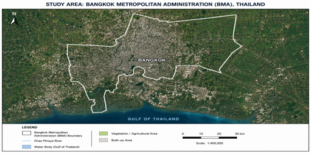

# Figures

This directory contains maps, visualizations, and statistical outputs generated during the study:

## Spatio-Temporal Analysis of Urban Thermal Variability and Surface Urban Heat Island Dynamics in Bangkok Using ECOSTRESS Data

---

## Figure 1. Study Area and Local Climate Zones (LCZ)

This figure presents the study area of the Bangkok Metropolitan Administration (BMA), Thailand, and the Local Climate Zone (LCZ) classification developed for this study.

The LCZ map was generated using Google Earth Engine (GEE) through supervised classification techniques. Training polygons representing different urban and land-cover classes were manually digitized based on visual interpretation of satellite imagery and urban morphological characteristics. The classified LCZ map was subsequently used to investigate spatial variations in Land Surface Temperature (LST) and Surface Urban Heat Island (SUHI) intensity across Bangkok.

### LCZ Classes Included

- Compact Mid-rise
- Open Mid-rise
- Open Low-rise
- Dense Trees
- Water Bodies

---

## Additional Figures Included in this Repository

### Thermal Environment

- ECOSTRESS Land Surface Temperature (LST) maps

### Vegetation and Built-up Indicators

- Normalized Difference Vegetation Index (NDVI) maps
- Normalized Difference Built-up Index (NDBI) maps

### Urban Morphology Indicators

- Mean Building Height
- Building Surface Fraction (BSF)

### Statistical Analysis

- NDVI versus LST relationships
- NDBI versus LST relationships
- Correlation matrix of LST, NDVI, and NDBI

---

## Purpose of the Figures

These figures were generated to examine the spatial variability of urban thermal conditions across Bangkok and evaluate the influence of vegetation cover, built-up intensity, and urban morphology on Land Surface Temperature patterns using ECOSTRESS observations.

---

## Software and Platforms Used

- Google Earth Engine (GEE)
- QGIS
- Python
- ECOSTRESS L2 LSTE Products
- ESA WorldCover
- OpenStreetMap
- Google Open Buildings Dataset
- Copernicus DEM
